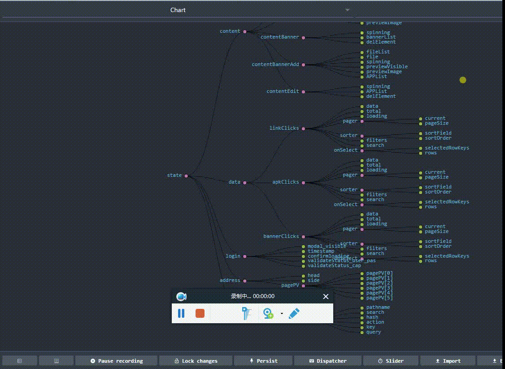
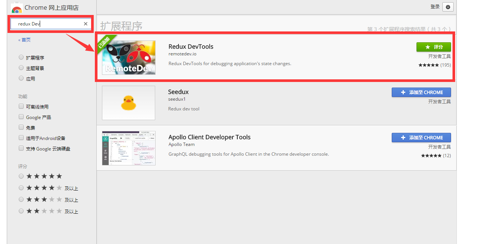
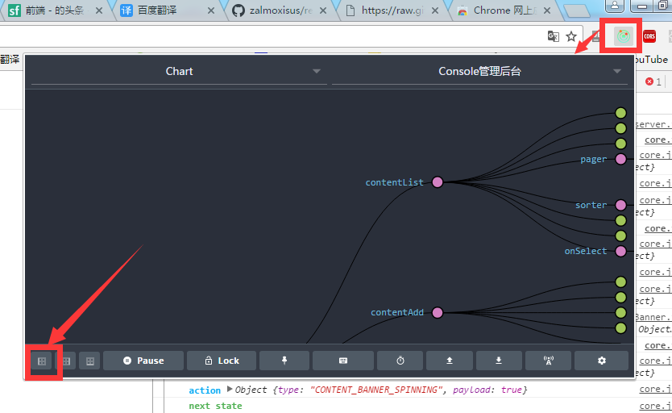
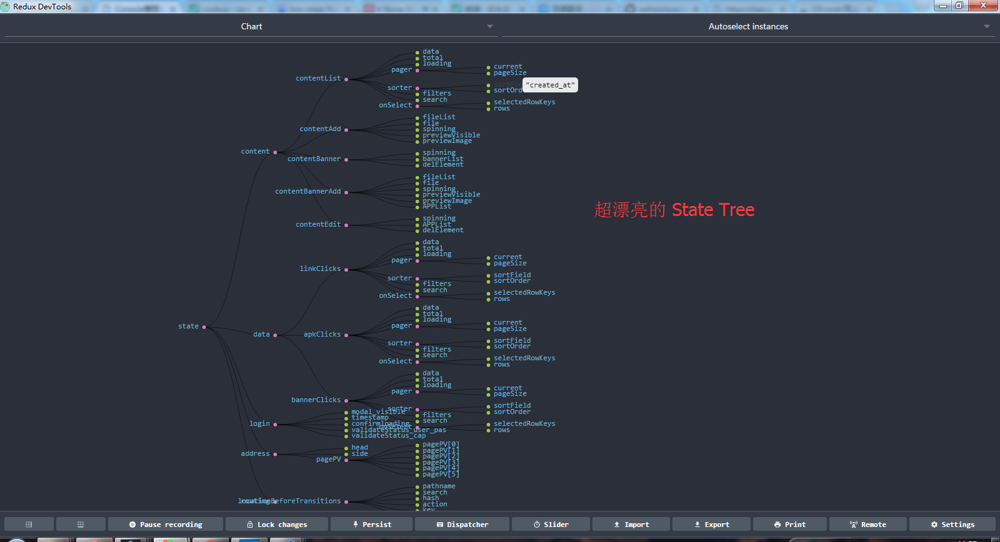
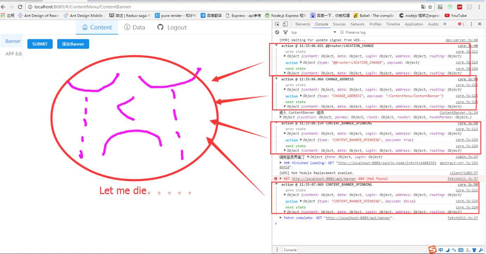

# 优雅到哭的 Redux DevTools 应用

## 预览

<p align="center">
    
</p>

## 超简单的使用方法

### 1、正常配置 Store 情况下

```jsx
import thunk from 'redux-thunk' // redux 作者开发的异步处理方案 可以在action 里传入 dispatch getState
import createLogger from 'redux-logger' // 利用redux-logger打印日志
import { createStore, applyMiddleware } from 'redux'; // 引入redux createStore、中间件及compose 
import reducer from '../reducers';// 引入reducers集合


// 调用日志打印方法 collapsed是让action折叠，看着舒服点
const loggerMiddleware = createLogger({collapsed:true});

// 创建一个中间件集合
const middleware = [thunk, loggerMiddleware];

//创建store
const store = createStore(
    reducer,
    applyMiddleware(...middleware) 
);

export default store;
```

### [2、前往 Chrome 商店 下载 redux DevTools](https://chrome.google.com/webstore/search/redux%20Dev?hl=zh-CN)
<p align="center">
    
</p>

### 3、在项目中安装 redux-devtools-extension 插件
- npm i redux-devtools-extension -D

### 4、加入redux-devtools-extension 插件后的配置

```jsx
import thunk from 'redux-thunk' // redux 作者开发的异步处理方案 可以在action 里传入 dispatch getState
import createLogger from 'redux-logger' // 利用redux-logger打印日志
import { createStore, applyMiddleware } from 'redux'; // 引入redux createStore、中间件及compose 
import reducer from '../reducers';// 引入reducers集合

//引入redux-devtools-extension的可视化工具（有点吊）
import { composeWithDevTools } from 'redux-devtools-extension';//devToolsEnhancer,

// 调用日志打印方法 collapsed是让action折叠，看着舒服点
const loggerMiddleware = createLogger({collapsed:true});

// 创建一个中间件集合
const middleware = [thunk, loggerMiddleware];

//创建store
const store = createStore(
    reducer,
    composeWithDevTools(
        applyMiddleware(...middleware)
    )
);

export default store;
```
### 其实也就是加入下面这几行代码而已
```jsx
import { composeWithDevTools } from 'redux-devtools-extension';
composeWithDevTools(
    applyMiddleware(...中间件)
)
```

### 5、正常运行项目后。。。
<p align="center">
    
</p>

<p align="center">
    
</p>

### 6、比原先的 redux-logger 好看多了

<p align="center">
    
</p>

# [更加详细的介绍，请参考](https://github.com/zalmoxisus/redux-devtools-extension)

